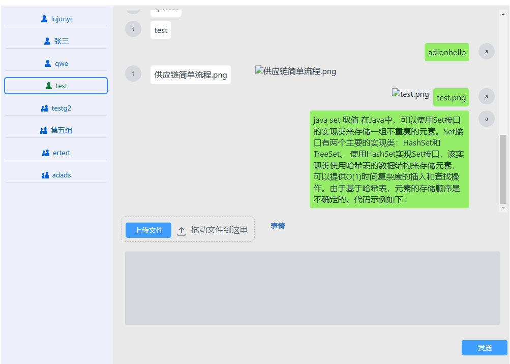

# vaadin chat

该项目使用JDK11+，测试建议JDK17

## 使用说明
本项目是一个个人开发的简单聊天系统，支持单聊、群聊，发送文件、图片
后端使用mysql数据库
文件使用minio存储

## Running the application

The project is a standard Maven project. To run it from the command line,
type `mvnw` (Windows), or `./mvnw` (Mac & Linux), then open
http://localhost:port in your browser.

You can also import the project to your IDE of choice as you would with any
Maven project. 

## Deploying to Production

To create a production build, call `mvnw clean package -Pproduction` (Windows),
or `./mvnw clean package -Pproduction` (Mac & Linux).
This will build a JAR file with all the dependencies and front-end resources,
ready to be deployed. The file can be found in the `target` folder after the build completes.

Once the JAR file is built, you can run it using
`java -jar target/vaadin-chat1.0.jar`

## Project structure

- `MainLayout.java` in `src/main/java` contains the navigation setup (i.e., the
  side/top bar and the main menu). This setup uses
  [App Layout](https://vaadin.com/docs/components/app-layout).
- `views` package in `src/main/java` contains the server-side Java views of your application.
- `views` folder in `frontend/` contains the client-side JavaScript views of your application.
- `themes` folder in `frontend/` contains the custom CSS styles.

  

### 使用MINIO说明
搭建好MINIO服务器后将API地址配置到application.properties中

